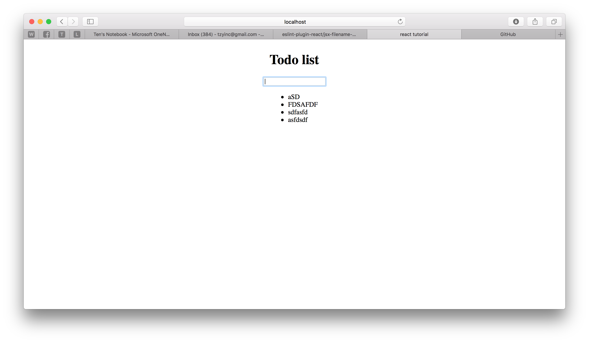

# Introduction
Yet another todo list tutorial. This is just for a couple of friends. It's a totally opinionated take on how to FE webdev, and I will deliberately skip steps so that you can google stuff (and read the docs) on your own. so learn at your own risk.

# Week 1
## tldr
setup npm, setup parcel, setup eslint, create hello world
## Setup
google these yourself
-install nodejs
-install npm (via nvm)
-(optional install yarn)

## Creating a hello world
init your npm project

`npm init -y`

install parcel

`npm install parcel-bundler --save`

you should use `--save-dev` for something like parcel as your production should have better ways to serve your app, but in this case for convenience, we want to just run `install` and then are able to host on our server with the exact same configuration as our dev machines, so that we don't have to worry about deployment problems.

the reason we use parcel is simple: it has zero configurations. In a proper working environment, we can expect to use webpack or rollup (google javascript bundlers, then google these), as there some some level of customizations, but parcel is good enough for now.

create a index.html, write a hello world in the body

configure `npm start` to host your index.html

now that we know parcel works, lets actually create a react hello world

## Creating a react hello world

`npm install react --save`
`npm install react-dom --save`

since react uses es6 (google it) lets install and setup babel, which transpiles es6 to es5 (google)

`npm install babel-preset-env babel-preset-react --save`

create a file `.babelrc` and in that file do this
```
{
  "presets": ["env", "react"]
}
```

~~optional~~ NOT OPTIONAL install eslint (these are my settings)

`npm install eslint --save-dev`

`export PKG=eslint-config-airbnb`

`npm info "$PKG" peerDependencies --json | command sed 's/[\{\},]//g ; s/: /@/g' | xargs npm install --save-dev "$PKG"`

put this in a file `.eslintrc` in your root folder
```
{
  "extends": "airbnb",
  "env": {
    "browser": true,
  },
  "rules": {
    "react/jsx-filename-extension": [1, { "extensions": [".js", ".jsx"] }],
  }
}
```

now that everything's set up, without using create-react-app, write a pure react component that just says 'hello world'

## create one component and a list
build this



## Week 1 walkthrough
### 1.0 setting up a hello world
first things first let's create something that will display a hello world. Look for the file generated during your npm init. this file is `package.json`. this file contains your npm settings as well as any scripts you will write. JSON stands for JavaScript Object Notation. It is the main way javascript mimics Object Oriented programming techniques. below shows the structure of a typical json Object

```
{ // json objects are wrapped by curly braces, anything inside are the contents
  "key_string_here": "value_string_here",
  // json objects are nothing more than a set of key-value mapping of javascript types
  "key1" : 1, // we end the mapping with a comma so that the browser knows when the mapping ends
  // the key are usually strings, and the values can be any type that js supports
  "key2": ["value1", "value2"],
  "key3": function(somevar) {return somevar;},
  "key4": true,
  // you can have json values that are arrays, functions, booleans, numbers, even array of functions
  "key5": {
    "subkey6": "value",
    "subkey7": "value"
  }
  //you can even have values that are other json objects and it can be "infinitely" deep
}
```

now look for the key titled `scripts`. this key itself contrains a json object of scripts that you can write to do a set of commands, just like you would do on the terminal. with `npm` you can only use pre-defined 'keys' for your scripts, there are ways to make other scripts but that's using other tools. [npm docs](https://docs.npmjs.com/misc/scripts).

now usually if you're using nodejs alone to run some javacript scripts you can just use the command `node your_file_here.js` and you can put that command into the `start` key, but since we are using parcel to run our project (because we want to use ES6, and most browsers support up to ES5, parcel transpiles (like compile but less powerful) our ES5 into ES6 for us) we can run our file by using the command `parcel you_file_here.html`

so under your scripts settings:
```
"scripts": {
  "start": "parcel src/index.html"
},
```
so now when you run `npm start`, your terminal will run `parcel src/index.html` for you. to keep our file structure clean, we are putting all our code inside the folder src. Our entry point (where the code will start running) will be `index.html`.

in your `index.html` put this
```
<html>
  <head>
      <title>react tutorial</title>
  </head>
<body>
  <div id="app"></div>
  <script src="./index.js"></script>
</body>
</html>
```
notice that the div id is `app` and that our script src is `./index.js` these will be relevant later

now in our src file, create `index.js`

Now react is one of the frameworks results in a **Single Page Application** this means that the user is always only on the same html page, and the contents of that html page always changes, but the user never really leaves the said webpage. This allows the advantage of never having to fully reload the webpage unless the user presses refresh. So when you have an SPA, and every page needs to have the same navigation bar at the top, it only loads once, and never needs to reload again. Now many pages are SPA but you can't tell because when you go to a different url, it looks almost entirely different. This is known as `routing` and people use libraries to make this behaviour look and feel like a multi page website. Note that `routing` means entirely different things on the front end stack and the back end stack (and also different in CS and routers and what not).

So now that we understand SPA, let's create something to display in our index.html page (using index.js).

react requires some boilerplate, so lets put in some boilerplate.
```
import React from 'react';
// this will import react into this js file, we already installed it earlier in npm install.
import ReactDOM from 'react-dom';
// this will be used at the end of the file, not important

class Homepage extends React.Component {
  // this line declares a class in ES6 syntax.
  componentWillMount() {}
  // this is part of the react life cycle

  render() {
    //just like a game engine, react will have a render function
    return (
      <div>
        hello world
      </div>
    );
    //the brackets are important! this line returns what this class will render
  }
}

const App = document.getElementById('app');
//this is to map the div with 'app' id into a javascript variable

ReactDOM.render(<Homepage />, App);
// this is to render this class (Homepage) into where the 'app' div is in the html page
```

now you should have a hello world.

### 1.1 States and Props
Every react component has a life cycle (imagine a game loop), we wont focus on that now, but its something you should know exists. A react component can have a state and props. The state and the props are just json objects. They are both considered **Immutable** that is, you cannot change them or override them (some exceptions). The reason why they are immutable is so that they are more predictable, and React can "trust" these values. You can think of this as giving up some flexibility in order for our code to be more reliable.

lets initialise a State
```
import React from 'react';
import ReactDOM from 'react-dom';

class Homepage extends React.Component {
  constructor() {
    super();
    // this is just boilerplate/good practice

    this.state = {
      somekey: 'some value',
    };
    // we are setting the initial state
  }

  componentWillMount() {}

  render() {
    const { somekey } = this.state;
    // this is javascript syntax for initialising the value 'somekey' into a constant in this function's scope.
    return (
      <div>
        hello world
        {somekey}
        {/* curly braces here allows you to insert javascript into JSX */}
      </div>
    );
  }
}

const App = document.getElementById('app');

ReactDOM.render(<Homepage />, App);
```

now that we got a state, let's modify it. what's happening here is when we call `setState`, we are creating a new State, and replacing the old state.

```
class Homepage extends React.Component {
  constructor() {
    super();

    this.state = {
      somekey: 'some value',
      somekey2: 0,
    };
  }

  componentWillMount() {}

  somefunctionname() {
    // this is how you create a function in the class
    const { somekey2 } = this.state;
    this.setState({ somekey2: somekey2 + 1 });
    // the first 'somekey2' is the key, while the seocond 'somekey2' is the variable that we initialised
  }

  render() {
    const { somekey, somekey2 } = this.state;
    return (
      <div onClick={() => this.somefunctionname()}>
        {/* () => {} is es6 syntax for anonymous functions. we have to create anonymous function here or else the function will be called when rendering, not from the onclick event*/}
        hello world
        {somekey}
        {somekey2}
      </div>
    );
  }
}
```

notice that while we changed somekey2, the value of somekey1 doesn't change. so `setState` essentially copies the previous state, and then replaces any keys within the state that are in `setState` function parameters. also notice that render happens after setState is called. this is part of the react lifecycle
